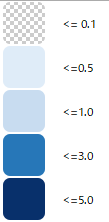

# 平成27年関東・東北豪雨時の常総市における浸水深

## 概要
平成27年関東・東北豪雨時の常総市における浸水深データをXYZタイル化したもの。

## タイルURL
https://melaka-strait.github.io/joso_shinsui_tiles_rev2/{z}/{x}/{y}.png

## ズームレベル
13-15

## 凡例

## 備考
QTilesを使用して生成。

## 出典
佐山・寶，2016により作成，一部簡略化
佐山敬洋・寶　馨（2016）：平成27年9月関東・東北豪雨による鬼怒川流域の洪水災害．京都大学防災研究所年報，59，pp.74-84.
